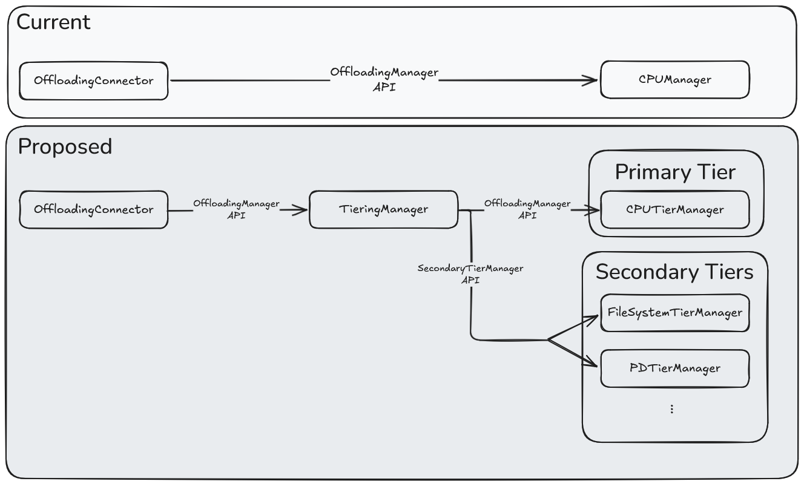

# RFC: Multi-Tier KV Cache Offloading

## Motivation

The native KV offloading in vLLM v1 currently supports offloading **from GPU memory** to an external location (like CPU memory). This RFC extends the design to allow offloading **from CPU memory** to additional tiers such as local storage, object storage, and remote nodes (P/D disaggregation).

## Proposed Changes



The `OffloadingConnector` interface is unchanged, it holds a single `OffloadingManager`. The new `TiersManager` implements that interface and orchestrates the tier hierarchy internally.

### Two tier types

**Primary Tier**: a single tier with exclusive access to GPU KV memory. The existing CPU Manager serves as the primary tier.

**Secondary Tier(s)**: one or more tiers with read/write access to the Primary Tier's CPU memory. No direct GPU access. Each secondary tier implements the `SecondaryTierManager` interface.

### SecondaryTierManager Interface

```python
class SecondaryTierManager(ABC):
    def lookup(block_hashes) -> int | None
    def submit_store(job_metadata: JobMetadata) -> None
    def submit_load(job_metadata: JobMetadata) -> None
    def get_finished() -> Iterable[JobResult]
    def touch(block_hashes)

@dataclass
class JobMetadata:
    job_id: int                         # unique job identifier
    block_hashes: list[BlockHash]       # which blocks are being transferred
    spec: CPUMemoryViewLoadStoreSpec    # memory views into CPU tensors + block IDs
```

`spec` is a zero-copy memory view into the primary tier's CPU tensors. For `submit_store` it is read-only (secondary tier reads from CPU); for `submit_load` it is writable (secondary tier writes into CPU).

### CPU Manager changes

Extend the CPU Manager to expose its worker's `cpu_tensors` so the `TiersManager` can pass **zero-copy memory views** to secondary tiers for direct reads and writes.

## Key Design Principles

1. **Always cascade to all tiers**: When a block is confirmed in the primary tier, it is asynchronously pushed to every secondary tier.
2. **Primary tier is the gateway**: Only the primary tier accesses GPU memory. Secondary tiers read/write CPU memory via memory views.
3. **Staged promotion**: Blocks in secondary tiers must be promoted to the primary tier before the GPU can access them. `lookup()` returns `None` while promotion is in progress (scheduler retries).
4. **Non-blocking scheduler methods**: All `SecondaryTierManager` methods run in the Scheduler process. `submit_store()` / `submit_load()` submit async jobs; `get_finished()` polls for completion.
5. **Secondary tiers own their evictions**: Each secondary tier manages its own eviction policy independently.

---

## Store Flow (Cascade)

```text
GPU → Primary Tier (CPU) → [all] Secondary Tiers
```

When `TiersManager.complete_store()` is called, the KV data is confirmed in CPU memory. The `TiersManager` calls `submit_store()` on every secondary tier to cascade the data asynchronously.

## Load Flow (Promotion)

```text
GPU ← Primary Tier (CPU) ← Secondary Tier
```

When `TiersManager.lookup()` is invoked:

1. Check primary tier first.
2. For remaining blocks, check each secondary tier in order.
3. On a hit, call `submit_load()` to initiate async promotion to the primary tier, then return `None` (retry later).

The `TiersManager` calls `get_finished()` on all secondary tiers each scheduling cycle to finalize completed jobs.
