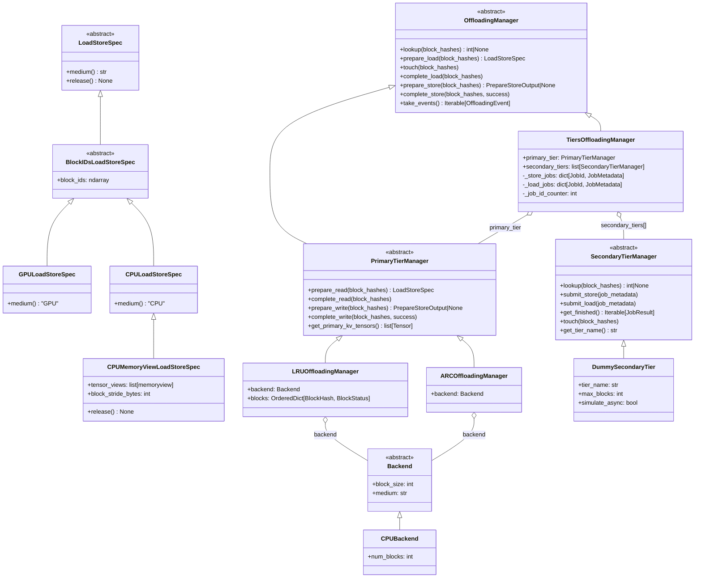
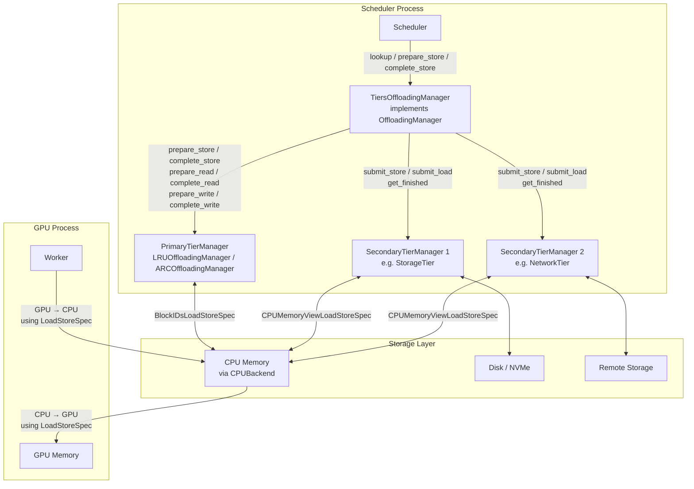
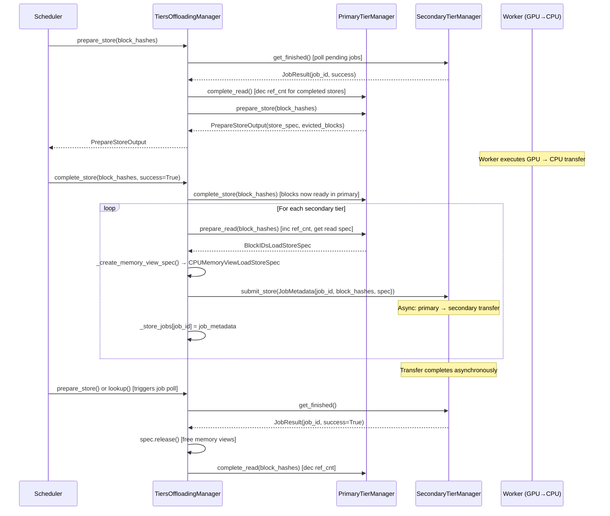
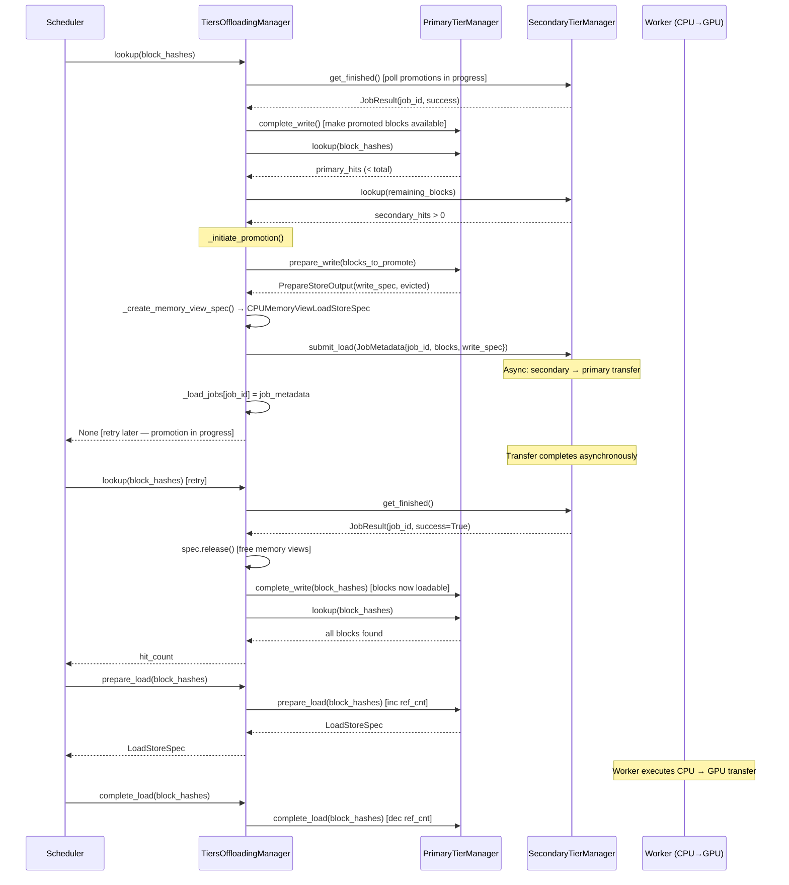
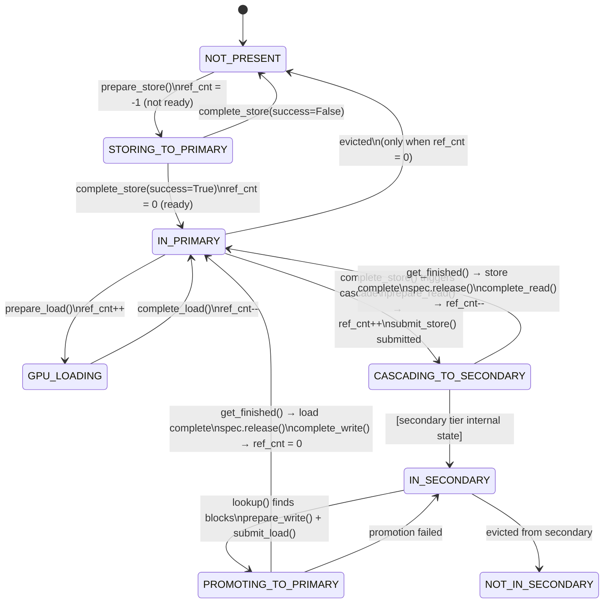
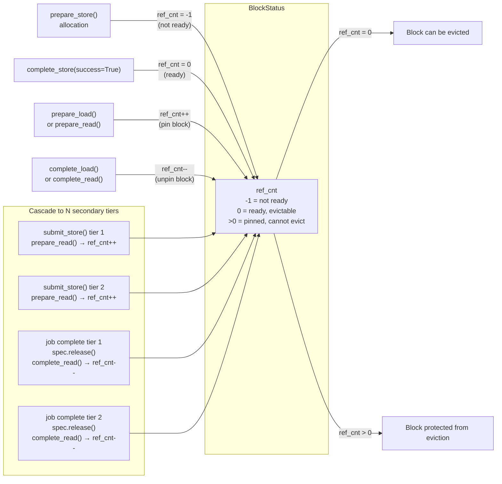

# Tiered KV Cache Offloading Architecture Design

## Executive Summary

This document presents a comprehensive design for extending vLLM's KV cache offloading system from single-tier (GPU ↔ primary tier) to multi-tier (GPU ↔ primary tier ↔ secondary tiers). The primary tier is currently implemented using CPU memory. The design maintains backward compatibility with the existing [`OffloadingManager`](vllm/v1/kv_offload/abstract.py:105) API while introducing new abstractions for secondary tiers.

## Terminology: Primary Tier vs CPU

**Important:** Throughout this document, "primary tier" refers to an **architectural abstraction** - the tier that has direct access to GPU memory and serves as the gateway for all GPU↔offload operations.

In the current implementation, the primary tier is realized using **CPU memory** via CPU-based managers like [`LRUOffloadingManager`](vllm/v1/kv_offload/lru_manager.py:16) or [`ARCOffloadingManager`](vllm/v1/kv_offload/arc_manager.py:16). However, the architecture is designed to support alternative primary tier implementations in the future.

When we refer to "CPU" in this document, we are discussing the specific implementation choice, not the architectural role.

---

**Key Design Principles:**

1. **Always offload to all tiers** — When a block is stored to the primary tier, it is cascaded to ALL secondary tiers
2. **Primary tier is the gateway** — Only the primary tier can directly access GPU memory (currently implemented using CPU memory)
3. **Staged promotion** — Blocks in secondary tiers must be promoted to the primary tier before GPU can access them
4. **Transparent retry mechanism** — Return `None` from `lookup()` to signal "data is being promoted, try later"
5. **Lightweight Scheduler methods** — All `SecondaryTierManager` methods run in the Scheduler process and must be non-blocking; actual data transfers are submitted asynchronously via `submit_load()` / `submit_store()`
6. **`ref_cnt` as eviction protection** — `primary.prepare_read()` increments `ref_cnt`, protecting blocks from eviction until `complete_read()` is called
7. **Secondary tiers own their evictions** — Each secondary tier is responsible for managing its own eviction policy
8. **Tier-agnostic API** — `PrimaryTierManager` provides intent-based methods (`prepare_read()`, `complete_read()`, `prepare_write()`, `complete_write()`) that work regardless of data flow direction

---

## 1. Current Architecture Analysis

### 1.1 Existing Components

**Core Abstractions:**

- [`OffloadingManager`](vllm/v1/kv_offload/abstract.py:105) — Scheduler-side interface for managing offloaded blocks
- [`PrimaryTierManager`](vllm/v1/kv_offload/abstract.py:202) — Extends `OffloadingManager` with tier-agnostic alias methods (`prepare_read()`, `complete_read()`, `prepare_write()`, `complete_write()`, `get_primary_kv_tensors()`)
- [`Backend`](vllm/v1/kv_offload/backend.py:37) — Allocates storage and provides load/store specs
- [`LoadStoreSpec`](vllm/v1/kv_offload/abstract.py:45) — Worker-side metadata for actual data transfer
- [`BlockStatus`](vllm/v1/kv_offload/backend.py:11) — Tracks block state (ready/not-ready, ref count)
- [`PrepareStoreOutput`](vllm/v1/kv_offload/abstract.py:65) — Output of `prepare_store()`: blocks to store, store spec, evicted blocks
- [`JobResult`](vllm/v1/kv_offload/abstract.py:88) — Result of a completed async job (`job_id`, `success`)
- [`JobMetadata`](vllm/v1/kv_offload/abstract.py:96) — Metadata for an in-flight job (`job_id`, `block_hashes`, `spec`)

**Medium Types** ([`mediums.py`](vllm/v1/kv_offload/mediums.py)):

- `GPULoadStoreSpec` — GPU memory spec
- `CPULoadStoreSpec` / `BlockIDsLoadStoreSpec` — CPU memory spec with block IDs
- `CPUMemoryViewLoadStoreSpec` — CPU memory spec with block IDs **and memory views** (used when passing data to secondary tiers)

**Existing Implementations:**

- [`LRUOffloadingManager`](vllm/v1/kv_offload/lru_manager.py:16) — LRU eviction policy (implements `PrimaryTierManager`)
- [`ARCOffloadingManager`](vllm/v1/kv_offload/arc_manager.py:16) — Adaptive Replacement Cache policy (implements `PrimaryTierManager`)
- [`CPUBackend`](vllm/v1/kv_offload/backends/cpu.py:20) — CPU memory backend

**Current Data Flow:**

```text
GPU ←→ primary tier (via OffloadingManager + CPUBackend)
     └─ Currently implemented using CPU memory
```

### 1.2 The `ref_cnt` Protection Mechanism

The [`BlockStatus`](vllm/v1/kv_offload/backend.py:11) in the primary tier tracks a `ref_cnt` for each block. This counter is the primary protection against eviction:

- **Incremented** by [`prepare_read()`](vllm/v1/kv_offload/abstract.py:252) (or `prepare_load()`) — protects a block from being evicted while it is being read or while it is the source for a secondary-tier store
- **Decremented** by [`complete_read()`](vllm/v1/kv_offload/abstract.py:269) (or `complete_load()`) — releases the protection, allowing the block to be evicted again

This mechanism is critical for the tiered design: when cascading a block from the primary tier to a secondary tier, `prepare_read()` must be called on the primary tier to pin the block in primary tier memory for the duration of the transfer. `complete_read()` is called once the async transfer completes (via `_process_finished_jobs()`).

**Tier-Agnostic API:** The [`PrimaryTierManager`](vllm/v1/kv_offload/abstract.py:202) provides intent-based methods that make the code self-documenting:

- `prepare_read()` / `complete_read()` — for ref_cnt management during async operations
- `prepare_write()` / `complete_write()` — for space allocation (aliases for `prepare_store()` / `complete_store()`)
- `get_primary_kv_tensors()` — returns the list of CPU tensors for direct memory access by secondary tiers

### 1.3 Extension Points

The architecture can be extended at two levels:

1. **Manager Level** — Create `TiersOffloadingManager` implementing [`OffloadingManager`](vllm/v1/kv_offload/abstract.py:105)
2. **Secondary Tier Level** — Create `SecondaryTierManager` implementations (Storage, Network, etc.)

---

## 2. SecondaryTierManager API Specification

### 2.1 Overview

[`SecondaryTierManager`](vllm/v1/kv_offload/abstract.py:302) is an abstract class for managing non-primary tiers. Unlike [`OffloadingManager`](vllm/v1/kv_offload/abstract.py:105), it cannot directly access GPU memory and must coordinate with the primary tier (currently CPU-based).

**Critical constraint:** All `SecondaryTierManager` methods are called from the **Scheduler process** and must be **lightweight and non-blocking**. They must not perform actual data transfers on the calling thread. Instead, `submit_load()` and `submit_store()` accept a `JobMetadata` parameter and submit async jobs for tracking.

### 2.2 The `JobMetadata` Contract

All job submissions use [`JobMetadata`](vllm/v1/kv_offload/abstract.py:96):

```python
@dataclass
class JobMetadata:
    """Metadata for an in-flight async transfer job."""
    job_id: JobId
    block_hashes: list[BlockHash]
    spec: LoadStoreSpec  # Always CPUMemoryViewLoadStoreSpec for secondary tiers
```

The `spec` field is always a `CPUMemoryViewLoadStoreSpec` (see [mediums.py](vllm/v1/kv_offload/mediums.py)), which carries both block IDs and memory views for direct CPU memory access. This conversion from `BlockIDsLoadStoreSpec` → `CPUMemoryViewLoadStoreSpec` is performed by `TiersOffloadingManager._create_memory_view_spec()` before calling `submit_store()` or `submit_load()`.

When a job completes, `get_finished()` returns [`JobResult`](vllm/v1/kv_offload/abstract.py:88):

```python
@dataclass
class JobResult:
    """Result of an async transfer job (successful or failed)."""
    job_id: JobId
    success: bool
```

`TiersOffloadingManager` determines whether a completed job was a store or load by checking `job_id` against its `_store_jobs` and `_load_jobs` dictionaries. The `JobResult` itself does not carry direction information.

### 2.3 Relationship Between `submit_store()` and `primary.prepare_read()`

When the `TiersOffloadingManager` cascades a block from the primary tier to a secondary tier:

1. **`primary.prepare_read(block_hashes)`** is called to obtain a `BlockIDsLoadStoreSpec` describing where the blocks live in primary tier memory. This also **increments `ref_cnt`** on those blocks, protecting them from eviction for the duration of the transfer.
2. The spec is converted to `CPUMemoryViewLoadStoreSpec` via `_create_memory_view_spec()`, then bundled into a `JobMetadata`.
3. **`secondary.submit_store(job_metadata)`** is called, submitting an async transfer job.
4. When `get_finished()` reports the job as complete, `job_metadata.spec.release()` is called to free memory views, then **`primary.complete_read(block_hashes)`** is called to **decrement `ref_cnt`**, releasing the eviction protection.

The tier-agnostic API makes the intent clear:

- **`prepare_read()`**: Explicitly states we're protecting blocks from eviction (internally calls `prepare_load()`)
- **`complete_read()`**: Explicitly states we're releasing protection (internally calls `complete_load()`)

When there are multiple secondary tiers, `primary.prepare_read()` must be called **once per secondary tier** to correctly increment `ref_cnt` for each pending transfer.

### 2.4 API Definition

```python
from abc import ABC, abstractmethod
from collections.abc import Iterable
from dataclasses import dataclass
from vllm.v1.core.kv_cache_utils import BlockHash
from vllm.v1.kv_offload.abstract import JobId, JobMetadata, JobResult, LoadStoreSpec

# JobId = int (type alias)

# JobResult has: job_id: JobId, success: bool
# JobMetadata has: job_id: JobId, block_hashes: list[BlockHash], spec: LoadStoreSpec


class SecondaryTierManager(ABC):
    """
    Abstract interface for managing a single non-primary offloading tier.

    Secondary tiers cannot directly access GPU memory. All data transfers
    must go through the primary tier (implemented as CPU in current version):
      - Store: GPU → primary → secondary  (cascade)
      - Load:  secondary → primary → GPU  (promotion)

    IMPORTANT: All methods run in the Scheduler process and must be
    lightweight and non-blocking. submit_load() and submit_store() submit
    async jobs; get_finished() polls for completion.
    """

    @abstractmethod
    def lookup(self, block_hashes: Iterable[BlockHash]) -> int | None:
        """
        Check which blocks exist in this secondary tier.

        Args:
            block_hashes: Block hashes to look up.

        Returns:
            Number of consecutive blocks (from start) that are present and ready,
            or None if blocks are being transferred (retry later).
        """
        pass

    @abstractmethod
    def submit_store(self, job_metadata: JobMetadata) -> None:
        """
        Submit an async job to store blocks from the primary tier to this
        secondary tier.

        job_metadata.spec is always CPUMemoryViewLoadStoreSpec (obtained via
        primary.prepare_read() then _create_memory_view_spec()).

        This method is responsible for:
          1. Filtering out blocks already present in this secondary tier
          2. Evicting blocks from this secondary tier if needed
          3. Allocating space in this secondary tier
          4. Submitting the async transfer: primary → secondary
        """
        pass

    @abstractmethod
    def submit_load(self, job_metadata: JobMetadata) -> None:
        """
        Submit an async job to load blocks from this secondary tier to the
        primary tier.

        job_metadata.spec is always CPUMemoryViewLoadStoreSpec (obtained via
        primary.prepare_write() then _create_memory_view_spec()).

        When get_finished() reports this job_id as complete,
        primary.complete_write() is called to make the blocks available for GPU loads.
        """
        pass

    @abstractmethod
    def get_finished(self) -> Iterable[JobResult]:
        """
        Poll for completed async jobs (both loads and stores).

        Returns JobResult with only job_id and success. TiersOffloadingManager
        determines job direction by looking up job_id in _store_jobs / _load_jobs.

        Returns:
            Iterable of JobResult objects for all jobs that have
            completed since the last call.
        """
        pass

    def touch(self, block_hashes: Iterable[BlockHash]):
        """Mark blocks as recently used for eviction policy."""
        return

    @abstractmethod
    def get_tier_name(self) -> str:
        """Get the name of this tier (e.g., "Storage", "Network")."""
        pass
```

### 2.5 Key Design Decisions

**Why `submit_` prefix instead of `load`/`store`?**

- Makes it explicit that the operation is asynchronous and non-blocking
- Distinguishes the submission step from the completion step (`get_finished()`)

**Why pass `JobMetadata` instead of separate `(job_id, block_hashes, spec)` params?**

- Groups related data into a single, reusable object
- `TiersOffloadingManager` stores `JobMetadata` in `_store_jobs`/`_load_jobs` for later lookup when `get_finished()` reports completion
- Mirrors the pattern in [`OffloadingConnectorWorker`](vllm/distributed/kv_transfer/kv_connector/v1/offloading_connector.py)

**Why does `JobResult` not carry `block_hashes` or direction?**

- `TiersOffloadingManager` already stores `JobMetadata` (with `block_hashes`) in `_store_jobs`/`_load_jobs`
- Direction is determined by which dict contains the `job_id`
- Avoids duplicating data between `JobResult` and `JobMetadata`

**Why `CPUMemoryViewLoadStoreSpec` for secondary tiers?**

- Secondary tiers need direct memory access to read/write CPU buffers
- `BlockIDsLoadStoreSpec` (returned by `prepare_read()`) only has block IDs; memory views are needed for the actual copy
- `_create_memory_view_spec()` in `TiersOffloadingManager` performs this conversion before calling `submit_store`/`submit_load`

**Why are secondary tiers responsible for their own evictions?**

- Each secondary tier has its own capacity and eviction policy
- Simplifies the coordination logic in `TiersOffloadingManager`

---

## 3. TiersOffloadingManager Architecture

### 3.1 Class Structure

```python
from vllm.v1.kv_offload.abstract import (
    JobId, JobMetadata, LoadStoreSpec, OffloadingEvent,
    OffloadingManager, PrepareStoreOutput,
    PrimaryTierManager, SecondaryTierManager,
)
from vllm.v1.kv_offload.mediums import BlockIDsLoadStoreSpec, CPUMemoryViewLoadStoreSpec


class TiersOffloadingManager(OffloadingManager):
    """
    Orchestrates multi-tier KV cache offloading.

    This manager coordinates between a primary tier (with GPU access, currently
    CPU-based) and zero or more secondary tiers (Storage, Network, etc.) to
    provide hierarchical KV cache offloading.

    Key internal state:
      - _store_jobs: dict[JobId, JobMetadata] — in-flight primary→secondary jobs
      - _load_jobs:  dict[JobId, JobMetadata] — in-flight secondary→primary jobs
      - _job_id_counter: monotonically increasing counter for job IDs
    """

    def __init__(
        self,
        primary_tier: PrimaryTierManager,   # Must be PrimaryTierManager, not OffloadingManager
        secondary_tiers: list[SecondaryTierManager] | None = None,
        enable_events: bool = False,
    ):
        self.primary_tier: PrimaryTierManager = primary_tier
        self.secondary_tiers = secondary_tiers or []

        self._job_id_counter: int = 0
        self.events: list[OffloadingEvent] | None = [] if enable_events else None

        # Job tracking dicts — used by _process_finished_jobs() to look up
        # block_hashes and determine direction when get_finished() fires
        self._store_jobs: dict[JobId, JobMetadata] = {}  # primary→secondary
        self._load_jobs:  dict[JobId, JobMetadata] = {}  # secondary→primary

    def _next_job_id(self) -> JobId: ...

    def _create_memory_view_spec(
        self, cpu_blocks_spec: LoadStoreSpec, readonly: bool = False
    ) -> CPUMemoryViewLoadStoreSpec:
        """
        Convert BlockIDsLoadStoreSpec → CPUMemoryViewLoadStoreSpec.

        Takes block IDs from the primary-tier spec and enhances them with
        memory views (obtained via primary_tier.get_primary_kv_tensors())
        so secondary tiers can do direct CPU memory copies.
        """
        assert isinstance(cpu_blocks_spec, BlockIDsLoadStoreSpec)
        cpu_tensors = self.primary_tier.get_primary_kv_tensors()
        return CPUMemoryViewLoadStoreSpec(
            block_ids=cpu_blocks_spec.block_ids.tolist(),
            cpu_tensors=cpu_tensors,
            readonly=readonly,
        )
```

### 3.2 `prepare_store()` and the `get_finished()` Call

A critical design point: **`prepare_store()` must call `_process_finished_jobs()` before calling `primary.prepare_store()`**. This ensures that:

1. Any previously completed async transfers have their `ref_cnt` decremented (via `primary.complete_read()`)
2. The primary tier has the most up-to-date view of which blocks are pinned, enabling accurate eviction decisions

```python
def prepare_store(
    self, block_hashes: Iterable[BlockHash]
) -> PrepareStoreOutput | None:
    # Step 1: Poll for completed async jobs FIRST
    # This decrements ref_cnt on primary blocks that have been
    # successfully transferred to secondary tiers.
    self._process_finished_jobs()

    # Step 2: Store to primary tier
    primary_result = self.primary_tier.prepare_store(block_hashes)

    # Note: Secondary tier cascading will happen in complete_store()
    # after the GPU→Primary transfer completes and blocks are ready.

    return primary_result
```

### 3.3 `complete_store()` and Secondary Tier Cascading

`complete_store()` is called by the connector when the GPU→Primary transfer finishes. This is where secondary tier cascading happens — after blocks are confirmed to be in the primary tier.

```python
def complete_store(self, block_hashes: Iterable[BlockHash], success: bool = True):
    # Materialize only if success=True (needed for cascading)
    block_hashes_list = list(block_hashes) if success else block_hashes

    # Step 1: Complete store in primary tier (makes blocks loadable)
    self.primary_tier.complete_store(block_hashes_list, success)

    if not success:
        return

    # Step 2: Cascade to ALL secondary tiers
    for tier in self.secondary_tiers:
        # Get spec for reading from primary AND increment ref_cnt
        primary_blocks_spec = self.primary_tier.prepare_read(block_hashes_list)

        # Convert to CPUMemoryViewLoadStoreSpec (readonly — secondary reads from primary)
        primary_read_spec = self._create_memory_view_spec(primary_blocks_spec, readonly=True)

        job_id = self._next_job_id()
        job_metadata = JobMetadata(
            job_id=job_id, block_hashes=block_hashes_list, spec=primary_read_spec
        )
        self._store_jobs[job_id] = job_metadata

        tier.submit_store(job_metadata)

    # Async transfers are now in-flight; tracked via _process_finished_jobs()
```

### 3.4 `_process_finished_jobs()` — The Completion Handler

This method polls all secondary tiers for completed jobs and updates state. Direction is determined by checking `_store_jobs` vs `_load_jobs`:

```python
def _process_finished_jobs(self):
    for tier in self.secondary_tiers:
        for completed_job in tier.get_finished():
            job_id = completed_job.job_id

            if job_id in self._store_jobs:
                # primary→secondary transfer completed.
                # Release memory views, then decrement ref_cnt.
                job_metadata = self._store_jobs.pop(job_id)
                job_metadata.spec.release()
                self.primary_tier.complete_read(job_metadata.block_hashes)

            elif job_id in self._load_jobs:
                # secondary→primary promotion completed.
                # Release memory views, then make blocks available.
                job_metadata = self._load_jobs.pop(job_id)
                job_metadata.spec.release()
                self.primary_tier.complete_write(
                    job_metadata.block_hashes, completed_job.success
                )

            else:
                raise ValueError(f"Unknown job_id {job_id}")
```

---

## 4. Tier Coordination and Routing Logic

### 4.1 Lookup Flow

**Algorithm:**

1. **Process finished jobs first** — ensures promoted blocks are finalized
2. **Primary Tier Check**
   ```python
   primary_hits = self.primary_tier.lookup(block_hashes)
   if primary_hits == len(block_hashes):
       return primary_hits  # All blocks in primary, done
   ```

3. **Secondary Tier Check** (iterates through all tiers for remaining blocks)
   ```python
   remaining_blocks = block_hashes_list[primary_hits:]
   has_promotions = False

   for tier in self.secondary_tiers:
       if not remaining_blocks:
           break

       secondary_hits = tier.lookup(remaining_blocks)

       # Skip if tier is busy (None) or has no hits (0)
       if not secondary_hits:
           continue

       # Found blocks — initiate promotion
       blocks_to_promote = remaining_blocks[:secondary_hits]
       self._initiate_promotion(tier, blocks_to_promote)
       has_promotions = True
       remaining_blocks = remaining_blocks[secondary_hits:]

   if has_promotions:
       return None  # Promotion initiated, retry later
   ```

4. **Return Result**
   ```python
   return primary_hits  # No more blocks found
   ```

> **Note:** `lookup()` returning `None` from a secondary tier is treated as "not found" (skipped). This could theoretically cause redundant promotions if the same blocks are in-flight to multiple tiers simultaneously. This is a known open issue documented in the codebase.

### 4.2 Store Flow (Cascade to ALL Tiers)

```text
Scheduler calls prepare_store(block_hashes)
    │
    ├─ 1. _process_finished_jobs()          ← poll secondary tiers first
    │       └─ spec.release() + complete_read() on primary ← decrement ref_cnt
    │
    ├─ 2. primary.prepare_store()           ← allocate primary tier space, evict if needed
    │
    └─ returns PrepareStoreOutput to Scheduler

    Worker executes GPU → primary transfer (using primary store_spec)

Scheduler calls complete_store(block_hashes)
    │
    ├─ 1. primary.complete_store()          ← blocks now loadable from primary
    │
    └─ 2. For EACH secondary tier:
            ├─ primary.prepare_read()     ← get BlockIDsLoadStoreSpec + increment ref_cnt
            ├─ _create_memory_view_spec()   ← convert to CPUMemoryViewLoadStoreSpec
            ├─ record job_metadata in _store_jobs
            └─ tier.submit_store(job_metadata)
                    └─ async: primary → secondary

Later: secondary tier completes async transfer
    └─ get_finished() → _process_finished_jobs()
            ├─ spec.release()               ← free memory views
            └─ primary.complete_read()   ← decrement ref_cnt
```

### 4.3 Load Flow (Promotion from Secondary to Primary)

```text
Scheduler calls lookup(block_hashes)
    └─ blocks found in secondary tier
            ├─ primary.prepare_write()    ← allocate primary tier space for promotion
            ├─ _create_memory_view_spec()   ← convert to CPUMemoryViewLoadStoreSpec
            ├─ record job_metadata in _load_jobs
            └─ tier.submit_load(job_metadata)
                    └─ async: secondary → primary

lookup() returns None (retry later)

Later: secondary tier completes async transfer
    └─ get_finished() → _process_finished_jobs()
            ├─ spec.release()               ← free memory views
            └─ primary.complete_write()    ← blocks now loadable from primary

Next lookup() call:
    └─ primary.lookup() returns hits        ← blocks now in primary
```

### 4.4 Tier-Agnostic API Usage

`PrimaryTierManager` provides intent-based methods that make the tiered manager code self-documenting:

| Method | Purpose | Internal Implementation |
| -------- | --------- | ------------------------ |
| `prepare_read()` | Protect blocks from eviction during async operations | Calls `prepare_load()` to increment `ref_cnt` |
| `complete_read()` | Release eviction protection | Calls `complete_load()` to decrement `ref_cnt` |
| `prepare_write()` | Allocate space for incoming blocks | Calls `prepare_store()` |
| `complete_write()` | Make allocated blocks available | Calls `complete_store()` |
| `get_primary_kv_tensors()` | Get CPU tensors for memory-view access | Returns list of CPU tensors (placeholder; to be implemented) |

**Usage in TiersOffloadingManager:**

| Operation | Method Used | Purpose |
| ----------- | ------------- | --------- |
| Cascade (primary→secondary) | `prepare_read()` | Get spec + protect blocks during async transfer |
| Cascade completion | `spec.release()` + `complete_read()` | Release memory views + protection after transfer |
| Promotion (secondary→primary) | `prepare_write()` | Allocate space in primary tier |
| Promotion completion | `spec.release()` + `complete_write()` | Release memory views + make promoted blocks available |

When there are N secondary tiers, `primary.prepare_read()` is called N times for the same set of blocks (in `complete_store()`), incrementing `ref_cnt` by N. Each completed secondary-tier store decrements it by 1 via `complete_read()`.

---

## 5. Architecture Diagrams

### 5.1 Class Hierarchy



### 5.2 System Architecture



**Key constraint:** GPU can only communicate with the **primary tier** (CPU memory). Secondary tiers must stage data through the primary tier.

### 5.3 Sequence Diagram: Store with Cascade



### 5.4 Sequence Diagram: Load with Promotion



### 5.5 Block State Machine



### 5.6 `ref_cnt` Protection Mechanism



**Rule:** When N secondary tiers are active, `prepare_read()` is called once per tier in `complete_store()`, incrementing `ref_cnt` by N. Each completed store decrements it by 1 via `complete_read()`.

---

## 6. Key Design Decisions Summary

| Aspect | Design Choice | Rationale |
| -------- | -------------- | ----------- |
| Secondary tier store method | `submit_store(job_metadata)` — async, returns `None` | Keeps Scheduler process responsive; actual transfers happen asynchronously |
| Secondary tier load method | `submit_load(job_metadata)` — async, returns `None` | Consistent with store; enables parallel transfers |
| Job submission parameter | `JobMetadata(job_id, block_hashes, spec)` dataclass | Groups related data; manager stores it for lookup at completion |
| Completion tracking | `get_finished()` returns `JobResult(job_id, success)` | Minimal result — direction and block_hashes are looked up from `_store_jobs`/`_load_jobs` |
| Transfer direction | Inferred from `_store_jobs` vs `_load_jobs` dict membership | Avoids duplicating data in `JobResult`; makes manager state explicit |
| Spec type for secondary tiers | `CPUMemoryViewLoadStoreSpec` (not plain `LoadStoreSpec`) | Secondary tiers need memory views for direct CPU access; conversion done by `_create_memory_view_spec()` |
| `spec.release()` | Called before `complete_read()`/`complete_write()` | Frees memory-view resources held by `CPUMemoryViewLoadStoreSpec` |
| Cascade timing | Happens in `complete_store()` after GPU→Primary completes | Ensures blocks are ready in primary before cascading to secondary tiers |
| `prepare_store()` ordering | Call `_process_finished_jobs()` first, then primary | Decrements ref_cnt before eviction decisions, enabling accurate capacity assessment |
| `primary.prepare_read()` in cascade | Called once per secondary tier in `complete_store()` | Gets transfer spec AND increments `ref_cnt` to protect blocks during async transfer |
| `ref_cnt` management | Via `prepare_read()` / `complete_read()` on `PrimaryTierManager` | Protects blocks from eviction during async transfers; one increment per secondary tier |
| Tier-agnostic API | Intent-based methods on `PrimaryTierManager` (separate from `OffloadingManager`) | Makes code self-documenting; separates concerns from data flow direction |
| Secondary tier evictions | Each tier manages its own eviction policy | Decentralized design; tiers are autonomous |
| Offload to all tiers | ALL secondary tiers receive every block stored to primary | Maximizes data availability across the tier hierarchy |

---

## 7. Migration Strategy and Usage

### 7.1 Using TierOffloadingSpec

[`TierOffloadingSpec`](vllm/v1/kv_offload/tiered.py) provides a high-level interface for configuring tiered offloading in vLLM. It is registered in [`OffloadingSpecFactory`](vllm/v1/kv_offload/factory.py) and can be used via `KVTransferConfig`.

**Configuration via KVTransferConfig:**

```python
from vllm.config import KVTransferConfig

kv_transfer_config = KVTransferConfig(
    kv_connector="OffloadingConnector",
    kv_role="kv_both",
    kv_connector_extra_config={
        "spec_name": "TierOffloadingSpec",  # Use tiered spec
        "cpu_bytes_to_use": 10 * 1024 * 1024 * 1024,  # Required: 10 GB for CPU tier
        "block_size": 16,  # Optional: offloaded block size
        "eviction_policy": "lru",  # Optional: "lru" or "arc" (default: "lru")
        "secondary_tiers": [  # Optional: list of secondary tier configs
            {
                "type": "dummy",        # Required: tier type
                "tier_name": "TestStorage",  # Required: tier name
                "max_blocks": 10000,    # Tier-specific: max blocks (DummySecondaryTier)
                "simulate_async": False # Tier-specific: for dummy tier
            }
        ]
    }
)
```

**Configuration Parameters:**

*Required:*

- `cpu_bytes_to_use` (int): Bytes to allocate for the CPU primary tier

*Optional:*

- `block_size` (int): Block size for offloaded blocks (default: GPU block size)
- `eviction_policy` (str): Primary tier eviction policy - `"lru"` (default) or `"arc"`
- `secondary_tiers` (list): List of secondary tier configurations (default: empty list)

*Secondary Tier Configuration:*

- `type` (str, **required**): Type of secondary tier (currently: `"dummy"`)
- `tier_name` (str, **required**): Name for this tier — used for logging and identification
- All other keys are passed as kwargs to the tier constructor

**Usage Examples:**

#### Example 1: Single-Tier (CPU only)

```python
kv_transfer_config = KVTransferConfig(
    kv_connector="OffloadingConnector",
    kv_role="kv_both",
    kv_connector_extra_config={
        "spec_name": "TierOffloadingSpec",
        "cpu_bytes_to_use": 5 * 1024 * 1024 * 1024,  # 5 GB
        "eviction_policy": "lru"
    }
)
```

#### Example 2: Two-Tier (CPU + Storage)

```python
kv_transfer_config = KVTransferConfig(
    kv_connector="OffloadingConnector",
    kv_role="kv_both",
    kv_connector_extra_config={
        "spec_name": "TierOffloadingSpec",
        "cpu_bytes_to_use": 5 * 1024 * 1024 * 1024,  # 5 GB
        "eviction_policy": "arc",
        "secondary_tiers": [
            {"type": "dummy", "tier_name": "Storage", "max_blocks": 50000}
        ]
    }
)
```

#### Example 3: Multi-Tier (CPU + Multiple Secondary Tiers)

```python
kv_transfer_config = KVTransferConfig(
    kv_connector="OffloadingConnector",
    kv_role="kv_both",
    kv_connector_extra_config={
        "spec_name": "TierOffloadingSpec",
        "cpu_bytes_to_use": 10 * 1024 * 1024 * 1024,  # 10 GB
        "secondary_tiers": [
            {"type": "dummy", "tier_name": "FastStorage", "max_blocks": 20000},
            {"type": "dummy", "tier_name": "SlowStorage", "max_blocks": 100000}
        ]
    }
)
```

### 7.2 Direct API Usage (Advanced)

For advanced use cases, you can directly instantiate `TiersOffloadingManager`:

```python
from vllm.v1.kv_offload.tiered_manager import TiersOffloadingManager
from vllm.v1.kv_offload.lru_manager import LRUOffloadingManager
from vllm.v1.kv_offload.backends.cpu import CPUBackend
from vllm.v1.kv_offload.secondary_tiers.dummy import DummySecondaryTier

# Create primary tier (CPU-based implementation)
cpu_backend = CPUBackend(block_size=16, num_blocks=1000)
primary_tier = LRUOffloadingManager(cpu_backend)  # LRUOffloadingManager is a PrimaryTierManager

# Create secondary tier(s)
storage_tier = DummySecondaryTier(
    tier_name="Storage",
    max_blocks=10000,
    simulate_async=False
)

# Wrap in tiered manager
manager = TiersOffloadingManager(
    primary_tier=primary_tier,
    secondary_tiers=[storage_tier]
)
```

### 7.3 Backward Compatibility

`TierOffloadingSpec` is fully backward compatible:

- Works with no secondary tiers (behaves like single-tier CPU offloading)
- Existing `CPUOffloadingSpec` continues to work unchanged
- Can be used as a drop-in replacement by changing `spec_name` in config

**Existing Code (unchanged):**

```python
# Using CPUOffloadingSpec (still works)
kv_transfer_config = KVTransferConfig(
    kv_connector="OffloadingConnector",
    kv_role="kv_both",
    kv_connector_extra_config={
        "spec_name": "CPUOffloadingSpec",  # or omit for default
        "cpu_bytes_to_use": 5 * 1024 * 1024 * 1024
    }
)
```

### 7.4 Extending with New Secondary Tier Types

To add a new secondary tier type (e.g., "storage", "network"):

1. Implement a class that extends [`SecondaryTierManager`](vllm/v1/kv_offload/abstract.py:302)
2. Add the type to `_create_secondary_tier()` in [`TierOffloadingSpec`](vllm/v1/kv_offload/tiered.py:127)

Example:

```python
def _create_secondary_tier(self, tier_config: dict):
    config = tier_config.copy()
    tier_type = config.pop("type", None)
    tier_name = config.pop("tier_name", None)

    if tier_type == "dummy":
        return DummySecondaryTier(tier_name=tier_name, **config)
    elif tier_type == "storage":
        return StorageSecondaryTier(tier_name=tier_name, **config)
    elif tier_type == "network":
        return NetworkSecondaryTier(tier_name=tier_name, **config)
    else:
        raise ValueError(f"Unknown secondary tier type: {tier_type}")
```
